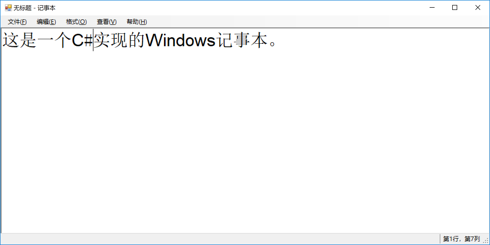

# Windows Notepad in C#
I wrote this C# implemented Windows Notepad when I was a sophomore. I just found this old project recently.
Despite using Chinese as the UI language, you can modify the code for switching it if you wish. PR is welcomed.

这是我大二时用C#写的Windows记事本。最近刚翻出来这份代码。
默认界面语言是中文，如果你想做一些国际化的话，欢迎fork这个项目发PR。

## LICENSE
MIT
